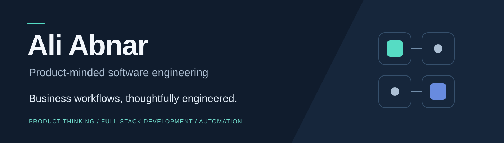

I turn business workflows into software people can use.

My background in product, growth, sales, and operations helps me connect implementation to a concrete need: the person doing the work, the rules they must follow, and the outcome the product should make possible.

I build web applications, internal tools, CRM workflows, and automation with TypeScript and React. My work spans Next.js, NestJS, Express, PostgreSQL, and document-based persistence. I use AI to support implementation while taking responsibility for product decisions, integration, and verification.

## Selected work

| Project | The problem | Explore |
| --- | --- | --- |
| **Rahbar — Company Operations** | Connect employee requests, approvals, tasks, CRM, and financial records | [Architecture, business rules, and hybrid AI workflows](https://github.com/aliabnar/engineering-portfolio/tree/main/case-studies/company-operations) |
| **Abnar Academy** | Connect career exploration, assessment, learning, and education operations | [Product flows, persistence, access, and CI evidence](https://github.com/aliabnar/engineering-portfolio/tree/main/case-studies/education-career-platform) |
| **Abnar OS — Workflow Prototype** | Explore how project delivery, capacity, and quality review fit together | [Workflow modeling and prototype boundaries](https://github.com/aliabnar/engineering-portfolio/tree/main/case-studies/agency-workflow-prototype) |

Commercial application source stays private. The public case studies explain the product decisions and implementation, with [dated verification notes](https://github.com/aliabnar/engineering-portfolio/blob/main/engineering/verification.md). Abnar OS is presented as a prototype.

## How I work

**Understand the workflow → define acceptance criteria → build → verify → iterate.**

I make business rules explicit, keep authorization in the application layer, document important trade-offs, and plan for data preservation when software changes.

I am interested in remote product engineering, full-stack development, internal tools, and business automation engagements.

[Explore my engineering portfolio](https://github.com/aliabnar/engineering-portfolio) · [Start a project conversation](https://github.com/aliabnar/engineering-portfolio/discussions)
